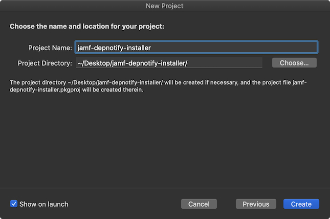
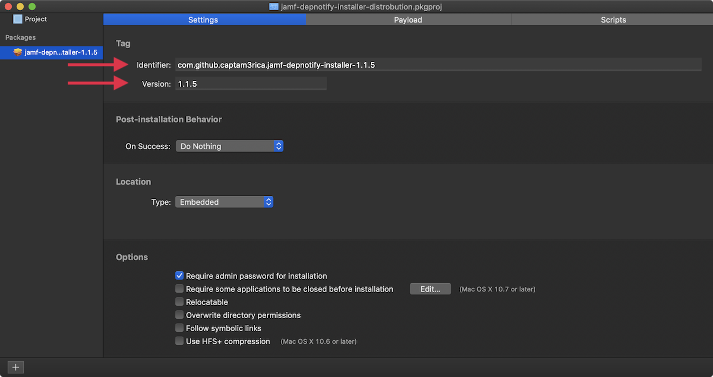
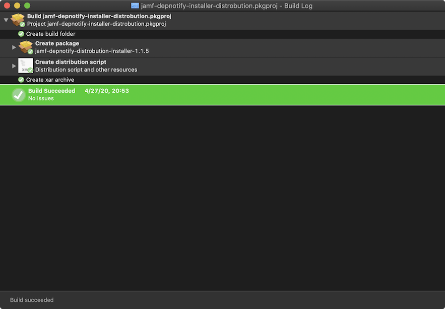
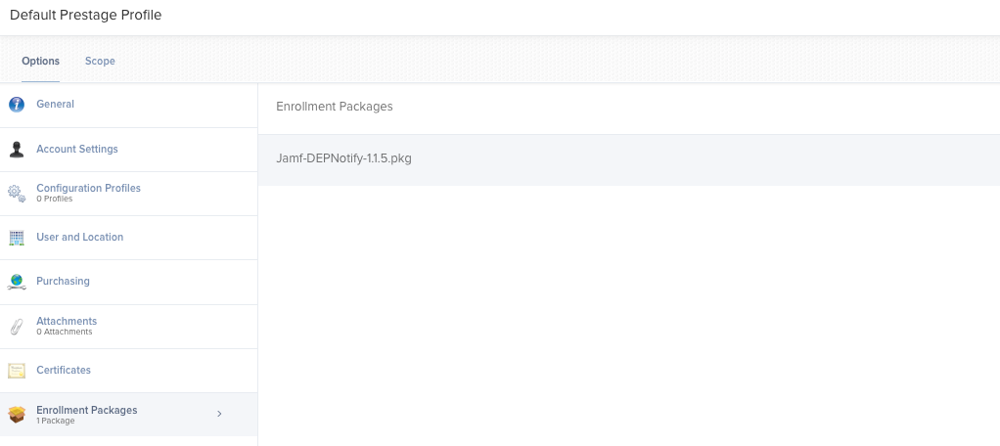

# jamf-depnotify-installer

About
===

Use this repo to assist with deployment of **[DEPNotify](https://gitlab.com/Mactroll/DEPNotify)** in a Jamf MDM environment.

Requirements
===

- A copy of the **[DEPNotify](https://gitlab.com/Mactroll/DEPNotify)** installer package.
- A macOS package builder.

    This repo uses [Packages](http://s.sudre.free.fr/Software/Packages/about.html), but there are others that can be used as well.
    
- A certificate that can be used to sign Installer packages.

    The cert can either be an Apple Developer Cert or a cert downloaded from your Jamf Cloud tenant.

Create a Signing Certificate with Jamf Pro
===

### Create the Certificate Signing Request (CSR)

1. On a Mac, open Keychain Access
1. Click on Keychain Access > Certificate Assistant > Request a Certificate From a Certificate Authority ...
1. Enter an email address for your organization
1. In the Common Name field enter your org name.
1. Select Save to disk and press Continue
1. In the Save dialogue choose a location to save the Certificate Signing Request (CSR)
1. Select Done in the Conclusion window. (A private key will be placed in the Keychain at the same time)
1. In Finder, go to the location where you saved the CSR.
1. Right-click the file then select Open With > TextEdit.
1. In the text file select and copy everything including the "-----BEGIN CERTIFICATE REQUEST-----" and "-----BEGIN CERTIFICATE REQUEST-----"

### Generate the Signing Cert in Jamf Pro

1. Now go to the Jamf Pro console in a Web Browser and go to Settings > Global Management > PKI Certificates
1. Select the Management Certificate Template tab and select the Create Certificate from CSR button.
1. Click inside the text field so that it is in focus. Then, paste the CSR text block that you copied earlier.
1. In the Certificate Type menu select Web Server Certificate then click the Create button.
1. The browser should automatically download a signed certificate file to your computer. (Typically the Downloads folder by default)
1. The file should have a .pem extension.
1. Double-click the cert file to open it.
1. If prompted to add the cert to a Keychain make sure that the login keychain is selected in the Keychain dropdown. Then click Add.
1. From within the Keychain Access app select the login keychain then in the bottom left select My Certificates.
1. In the list, you should see the certificate that was just imported.
1. The see the private key associated with the cert that was just imported select the little disclosure triangle to the left of the cert.
1. If the Mac used to generate the CSR is enrolled in your Jamf instance then it will trust the certificate created by the CSR. If not you will need to modify the Trust settings

    1. Double-clicking the cert
    1. Click the disclosure triangle next to the When using this certificate and select Always Trust.
    1. Choose File > Close.
    1. Enter your credentials on the You are making changes to your Certificate Trust Settings" dialogue.
    1. Make sure that the cert is trusted by looking for the green checkmark icon saying this cert is valid.
    
1. (optional) Export the cert and apply a password as a backup for use on another Mac.
1. Quit Keychain Access

Build the Installer Package
===

This example uses [Packages](http://s.sudre.free.fr/Software/Packages/about.html) to repackage the DEPNotify app.

A copy of the `.pkgproj` file that I used to create my installer package can be found [here](https://github.com/icwfrepo/DEPNotifyers/tree/master/jamf-depnotify-installer/packages-project).

### New Project

Launch **Packages** and create a new distribution project.

Give the project a **Name**, set the path to **Relative to Project**, and select a **Reference Folder** (The place where you want to store the project.)

### Add the Signing Certificate

1. In the menu bar select Project > Set Certificate
1. Choose the Signing Certificate from the list. (either an Apple Dev Cert or the one generated from Jamf Pro).
1. Enter your credentials if prompted.
1. In the upper right corner of the Packages.app window you should she a Certificate seal.

### Main Settings Tab

On the **Settings** tab add the current DEPNotify version to the end of the package name. As of this writing DEPNotify is on version 1.1.5

### Package Settings Tab

On the left-hand side select the `jamf-depnotify-installer` package.

On the the package Settings tab set the **Identifier** and a **Version** number on the Settings tab if you wish. I like to set the version number to the version of the original application that I am working with. In this case DENotify is on 1.1.5.

The identifier will become the bundleID for this package.

### Payload Tab (Optional)

If you plan on displaying icons in DEPNotify as the Mac is being configured buildout a directory structure similar to the below then drag your images into the icons folder.

An easy way to do this is to create the folder structure on your Mac then drag the top level folder into the Package Payload tab.

### Scripts Tab

1. On the Scripts tab drag the `post-install.sh` script into the square. Make sure that the **R** for Relative to Project option is selected underneath the script.

2. Drag the original [DEPNotify app](https://gitlab.com/Mactroll/DEPNotify) installer package into the **Additional Resources** area, and make sure that the **Reference** is set to **Relative to Project**.

### Build the Package

Once everything is in the new package press **Command + S** to save your work. Then, press **Command + B** to build the package.

Upload the Package to Jamf
===

### Upload

Once the package is created upload it to Jamf. 

### Prestage Enrollment Profile

Add the package to your Pre-Stage Enrollment profile.

Update the Script
===

Make sure to update the policy array section of the script to include the customer triggers policies that you would like to have installed during the provisioning process. The second portion of each item in the array following the comma should match the customer trigger in the associated policy in Jamf.

The policies in this array will install in the order that they appear in the array.

Jamf Policies
===

**NOTE:** Make sure to upload `jamf_depnotify_start.sh` to Jamf as a script before creating the policies.

### Jamf DEPNotify Start Enrollment

**General settings tab**

**Scripts payload tab**

**Policy Scope**

You can scope the policy to **All Computers/All Users** or create a Smart Group with the following criteria and scope this policy to that smart group.

_Smart Group_

_Scope_

